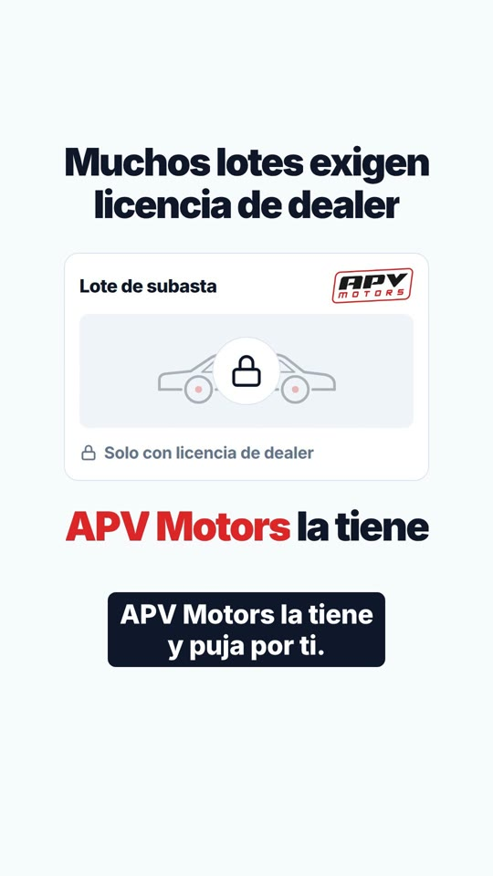
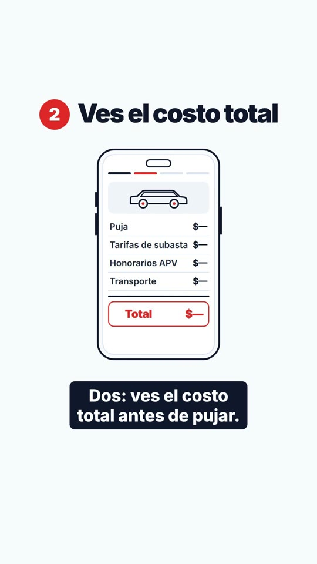
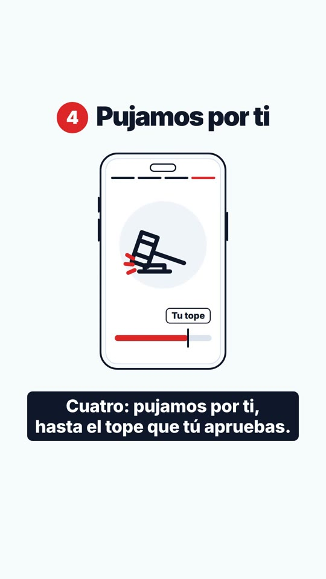

# RESUMEN — APV Motors · video «primera vez» (45 s)

## Entregables (`video-primera-vez/out/`)
| Archivo | Formato | Duración | Peso | Sonoridad |
|---|---|---|---|---|
| `apv-primera-vez-9x16-web.mp4` | 1080×1920 · H.264 High + AAC 128k · 30 fps | 1350 fotogramas (45,000 s de video) | 7,26 MB | −14,0 LUFS |
| `apv-primera-vez-9x16-social.mp4` | 1080×1920 · H.264 High + AAC 128k · 30 fps | 1350 fotogramas | 3,69 MB | −14,0 LUFS |
| `apv-primera-vez-16x9-web.mp4` | 1920×1080 · H.264 High + AAC 128k · 30 fps | 1350 fotogramas | 7,39 MB | −14,0 LUFS |
| `poster-9x16.jpg`, `poster-16x9.jpg` | Fotograma final de la escena 1 (pregunta completa, sin subtítulo) | | | |
| `subtitulos-es.vtt`, `subtitulos-es.srt` | 16 bloques, máx. 2 líneas × 32 caracteres, texto literal del guion | | | |
| `../clips/9x16/escena-NN.mp4`, `../clips/16x9/escena-NN.mp4` | 22 clips de HyperFrames (duración de escena + 12 frames de colchón) | | | |

El contenedor MP4 reporta 45,014 s porque el audio AAC se empaqueta en bloques de 21 ms. La pista de video
tiene exactamente 1350 fotogramas (45,000 s) en las tres versiones.

Las dos versiones web usan codificación a tasa fija en dos pasadas para quedar por debajo de 8 MB. La social usa
CRF 19: al ser gráficos planos pesa menos, aunque no tiene límite de tamaño.

## Versiones usadas
- **HyperFrames 0.8.81** (CLI y runtime) y **GSAP 3.15.0**, con las skills oficiales `heygen-com/hyperframes`
  instaladas con `npx skills add` y leídas antes de escribir las escenas: `hyperframes`, `hyperframes-core`,
  `hyperframes-cli` y sus referencias.
- **Remotion 4.0.529**, con `@remotion/transitions`, `@remotion/media`, `@remotion/fonts`, `@remotion/bundler` y
  `@remotion/renderer`.
- Node.js 22.22.2 y FFmpeg 6.1.1. Transcripción con faster-whisper (modelo `small`).

## Duración real por escena (ajustada a la locución real)
| Escena | Tramo (s) | Frames | Duración (s) | Voz (s) |
|---|---|---|---|---|
| 01 · Gancho | 0,00–3,27 | 98 | 3,27 | 2,53 |
| 02 · Subastas | 3,27–9,17 | 177 | 5,90 | 5,50 |
| 03 · Licencia [LEGAL] | 9,17–15,43 | 188 | 6,27 | 5,93 |
| 04 · Así funciona | 15,43–17,40 | 59 | 1,97 | 0,77 |
| 05 · Paso 1 | 17,40–20,37 | 89 | 2,97 | 2,27 |
| 06 · Paso 2 | 20,37–23,77 | 102 | 3,40 | 2,83 |
| 07 · Paso 3 | 23,77–26,73 | 89 | 2,97 | 2,30 |
| 08 · Paso 4 | 26,73–30,40 | 110 | 3,67 | 3,20 |
| 09 · Daño/salvamento | 30,40–36,13 | 172 | 5,73 | 5,40 |
| 10 · Honorarios | 36,13–40,10 | 119 | 3,97 | 3,63 |
| 11 · Cierre + CTA | 40,10–45,00 | 147 | 4,90 | 3,73 (termina con más de 1 s fijo) |
| **Total** | | **1350** | **45,00** | 38,1 |

`scripts/build-timing.py` reparte la duración:
- Cada escena dura al menos su locución más un respiro.
- El resto se reparte según los tiempos nominales del guion.
- Ninguna escena se estiró ni se aceleró: cada clip se renderizó en HyperFrames con su duración final.

## Textos [LEGAL] pendientes de validación
1. **Escena 03, locución:** «Muchos lotes solo admiten compradores con licencia de dealer. APV Motors la tiene y
   puja por ti.»
2. **Escena 03, pantalla:** «Muchos lotes exigen licencia de dealer» · «APV Motors la tiene» (tarjeta: «Solo con
   licencia de dealer» → «Acceso con APV Motors»).

Sin marca [LEGAL] en el guion, pero recomendamos que el equipo legal revise también:
- **Escena 07:** «depósito reembolsable».
- **Escena 10:** «Honorarios fijos desde 350 dólares, solo si ganas».

## Origen y licencia de la música y la voz
- **Música:** pista original sintetizada por código (`scripts/make-music.py`): 104 BPM, pad, arpegio, bajo y
  percusión ligera. No usa samples ni material de terceros; es propiedad del proyecto y libre de derechos.
  - Normalizada a −18 LUFS en `assets/music.mp3`, con ducking en Remotion: nivel base bajo la voz y +3 dB en los
    huecos sin voz.
  - En el master final queda a unos −19,7 LUFS bajo la voz (ver contradicción 5).
- **Voz:** «Valeria», la voz aprobada por el cliente para los videos en español (ver `docs/voces.md`).
  - Es un clon hecho en **Higgsfield · Seed Audio (ByteDance)** a partir de la muestra pública de la voz «Valeria –
    Warm & Expressive» de la biblioteca de ElevenLabs (`WwdAeR5vLd7Sa27ddCLi`, es-latin-american).
  - Generada con la cuenta de Higgsfield del cliente: 13 tomas, de las que se usan 11.
  - **Pendiente de revisar:** los términos de uso comercial de Higgsfield y de la voz de biblioteca de ElevenLabs
    para publicidad pagada.
  - El texto de la locución es el del guion. En `copy.json → tts` solo cambia la ortografía para la
    pronunciación: «A, pe, be, Motors», «díler», «trescientos cincuenta».

## Contradicciones entre el prompt y la documentación o el entorno
1. **Dos composiciones por proyecto HyperFrames.** `hyperframes lint` rechaza varias composiciones raíz
   (`multiple_root_compositions`). La 9:16 es `index.html` y la 16:9 está en `compositions/horizontal.html`, que
   se renderiza con `--composition`. Las rutas de assets son relativas a la raíz del proyecto en ambos archivos:
   así lo sirve HyperFrames, y lint rechaza `../`.
2. **Duración exacta de los clips.** HyperFrames redondea hacia arriba `data-duration × fps`. Por eso el script
   escribe (N − 0,001)/30 s para obtener exactamente N fotogramas.
3. **Video en Remotion.** La documentación actual recomienda `<Video>` de `@remotion/media` en lugar de
   `<OffthreadVideo>`, y se usa `<Video>`. Las transiciones son `TransitionSeries` con `fade()` y
   `wipe()` de 10 frames; cada transición consume 10 de los 12 frames de colchón del clip saliente, así que el
   total se mantiene en 1350.
4. **Voz.** El prompt pide ElevenLabs (`eleven_multilingual_v2`) si existe `ELEVENLABS_API_KEY`, pero el cliente
   pidió usar la voz Valeria. Además, en el entorno no hay `ELEVENLABS_API_KEY` y los créditos de ElevenLabs no
   alcanzaban.
5. **Niveles de audio.** No se pueden cumplir a la vez «música a −18 LUFS bajo la voz» y «−14 LUFS integrado
   final» con buena inteligibilidad: la voz quedaría solo ~1 dB por encima de la música. Se priorizó la
   inteligibilidad:
   - música preparada a −18 LUFS;
   - voz a −14 LUFS por toma;
   - master lineal a −14,0 LUFS / −1,5 dBTP, con la música unos 4 dB bajo la voz.
   - Whisper transcribe la mezcla final completa.
6. **Activos de marca.** El repo del sitio (`aharongp/landing-apv`) no tiene el logo en SVG. Se usa el PNG
   oficial `public/assets/apv-logo-red.png`, de 495×219.
   - Colores de `public/styles.css`: `--primary #dc2626`, `--ink #0f172a`, `--soft-2 #f8fafc`.
   - Titulares en Inter 900 con tracking −0,045em, como en los `h1`/`h2` del sitio.
   - El sitio no carga Inter como webfont (`docs/PLAN_CAMBIOS.md`); en el video se incrusta Inter local.
7. **Skills y preview.** El flujo de las skills (entrevista, `BRIEF.md`, aprobación en Studio antes de renderizar)
   se omitió porque el prompt ya fija guion, escenas y formato. Se usó `npx hyperframes lint` y `snapshot`, y un
   render `draft` por escena para revisar.

## Verificación (`scripts/verify.py` y revisión visual)
- En los 22 clips, la franja de subtítulos y las zonas no seguras están vacías en todos los fotogramas
  muestreados. La franja del CTA de la escena 11 está libre.
- En los 3 MP4, los 250 px superiores y 420 px inferiores del vertical no tienen contenido.
- Cada MP4 tiene 1350 fotogramas, sin fotogramas negros (blackdetect) y se decodifica completo sin errores.
- Cada MP4 está a −14,0 LUFS, y las versiones web pesan ≤ 8 MB.
- Subtítulos de 58 px en vertical (50 px en horizontal), blanco sobre `#0f172a`, máximo 2 líneas × 32 caracteres.
- Sin logos de terceros («Copart» solo como texto), sin fotos, sin personas, sin cifras de ahorro. Los montos
  del desglose aparecen como «$—». Se usa «auto», nunca «coche».
- Colores y tipografía de un único `brand.json`, que se inyecta en las 22 composiciones y en Remotion.

## Capturas (versión 9:16 web)
| | | |
|---|---|---|
|  |  |  |
| Escena 1 · Gancho | Escena 3 · Licencia [LEGAL] | Escena 6 · Costo total |
|  |  |  |
| Escena 8 · Pujamos por ti | Escena 10 · Honorarios | Escena 11 · Cierre + CTA web |
